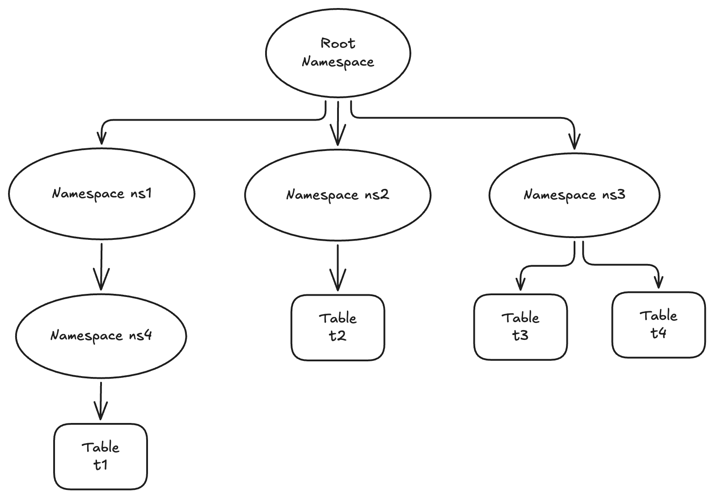

# Lance Namespace Specification

**Lance Namespace Specification** is an open specification on top of the storage-based Lance data format 
to standardize access to a collection of Lance tables (a.k.a. Lance datasets).
It describes how a metadata service like Apache Hive MetaStore (HMS), Apache Gravitino, Unity Namespace, etc.
should store and use Lance tables, as well as how ML/AI tools and analytics compute engines
(will together be called _"tools"_ in this document) should integrate with Lance tables.

## Namespace Concepts

### Namespace Definition

A Lance namespace is a centralized repository for discovering, organizing, and managing Lance tables.
It can either contain a collection of tables, or a collection of Lance namespaces recursively.
It is designed to encapsulates concepts including namespace, catalog, metastore, database, schema, etc.
that frequently appear in other similar data systems to allow easy integration with any system of any type of object hierarchy.

Here is an example layout of a Lance namespace:



### Parent & Child

We use the term **parent** and **child** to describe relationship between 2 objects.
If namespace A directly contains B, then A is the parent namespace of B, i.e. B is a child of A.
For examples:

- Namespace `ns1` contains a **child namespace** `ns4`. i.e. `ns1` is the **parent namespace** of `ns4`.
- Namespace `ns2` contains a **child table** `t2`, i.e. `t2` belongs to **parent namespace** `ns2`.

### Root Namespace

A root namespace is a namespace that has no parent.
The root namespace is assumed to always exist and is ready to be connected to by a tool to explore objects in the namespace.
The lifecycle management (e.g. creation, deletion) of the root namespace is out of scope of this specification.

### Object Name

The **name** of an object is a string that uniquely identifies the object within the parent namespace it belongs to.
The name of any object must be unique among all other objects that share the same parent namespace.
For examples:
 
- `cat2`, `cat3` and `cat4` are all unique names under the root namespace
- `t3` and `t4` are both unique names under `cat4`

### Object Identifier

The **identifier** of an object uniquely identifies the object within the root namespace it belongs to.
The identifier of any object must be unique among all other objects that share the same root namespace.

Based on the uniqueness property of an object name within its parent namespace, 
an object identifier is the list of object names starting from (not including) the root namespace to (including) the object itself.
This is also called an **list identifier**.
For examples:

- the list identifier of `cat5` is `[cat2, cat5]`
- the list identifier of `t1` is `[cat2, cat5, t1]`

The dot (`.`) symbol is typically used as the delimiter to join all the names to form an **string identifier**, 
but other symbols could also be used if dot is used in the object name.
For examples:

- the string identifier of `cat5` is `cat2.cat5`
- the string identifier of `t1` is `cat2.cat5.t1`
- the string identifier of `t3` is `cat4$t3` when using delimiter `$`

### Name and Identifier for Root Namespace

The root namespace itself has no name or identifier.
When represented in code, its name and string identifier is represented by an empty or null string,
and its list identifier is represented by an empty or null list.

The actual name and identifier of the root namespace is typically 
assigned by users through some configuration when used in a tool.
For example, a root namespace can be called `cat1` in Ray, but called `cat2` in Apache Spark,
and they are both configured to connect to the same root namespace.

## Namespace Types

There are 2 types of Lance namespaces: directory and REST.

### Lance Directory Namespace

**Lance directory namespace** is a lightweight and simple Lance namespace that only contains a list of tables.
People can easily get started with creating and using Lance tables directly on top of any 
local or remote storage system with a Lance directory namespace.

A directory namespace maps to a directory on storage, we call such directory a **namespace directory**.
A Lance table corresponds to a subdirectory in the namespace directory.
We call such a subdirectories **table directory**.
Consider the following example namespace directory layout:

```
.
└── /my/dir1/
    ├── table1/
    │   ├── data/
    │   │   ├── 0aa36d91-8293-406b-958c-faf9e7547938.lance
    │   │   └── ed7af55d-b064-4442-bcb5-47b524e98d0e.lance
    │   ├── _versions/
    │   │   └── 9223372036854775707.manifest
    │   ├── _indices/
    │   │   └── 85814508-ed9a-41f2-b939-2050bb7a0ed5-fts/
    │   │       └── index.idx
    │   └── _deletions/
    │       └── 75c69434-cde5-4c80-9fe1-e79a6d952fbf.bin
    ├── table2
    └── table3
```

This describes a Lance directory namespace with the namespace directory at `/my/dir1/`.
It contains tables `table1`, `table2`, `table3` sitting at table directories 
`/my/dirs/table1`, `/my/dirs/table2`, `/my/dirs/table3` respectively.

#### Directory Path

There are 3 ways to specify a directory path:

1. **URI**: a URI that follows the [RFC 3986 specification](https://datatracker.ietf.org/doc/html/rfc3986), e.g. `s3://mu-bucket/prefix`.
2. **Absolute POSIX storage path**: an absolute file path in a POSIX standard storage, e.g. `/my/dir`.
3. **Relative POSIX storage path**: a relative file path in a POSIX standard storage, e.g. `my/dir2`, `./my/dir3`.
   The absolute path of the directory should be based on the current directory of the running process.

#### Table Existence

A table exists in a Lance directory namespace if a table directory of the specific name exists.
This is true even if the directory is empty or the contents in the directory does not follow the Lance table format spec.
For such cases, an operation that lists all tables in the directory should show the specific table,
and an operation that checks if a table exists should return true.
However, an operation that loads the Lance table metadata should fail with error 
indicating the content in the folder is not compliant with the Lance table format spec.

### Lance REST Namespace

In an enterprise environment, typically there is a requirement to store tables in a metadata service 
such as Apache Hive MetaStore, Apache Gravitino, Unity Catalog, etc. 
for more advanced governance features around access control, auditing, lineage tracking, etc.
**Lance REST Namespace** is an OpenAPI protocol that enables reading, writing and managing Lance tables
by connecting those metadata services or building a custom metadata server in a standardized way.
The detailed OpenAPI specification content can be found in [rest.yaml](./rest.yaml).

#### Namespace Server and Adapter

Any REST HTTP server that implements this OpenAPI protocol is called a **Lance Namespace server**.
If the main purpose of this server is to be a proxy on top of an existing metadata service,
converting back and forth between Lance REST API models and native API models of the metadata service,
then this Lance namespace server is called a **Lance Namespace adapter**.

#### Server and Storage

Under the REST protocol, a Lance table exists both in the storage and the server.
There are 2 possible ways to manage a Lance table under such setting.
A Lance namespace server can choose to support one or both ways.

##### Server Managed Table

A server managed Lance table is a table that is fully managed by the Lance namespace server.
The server must maintain information about the latest version of the Lance table.
Any modifications to the table must happen through the server.
If a user directly modifies the underlying table in the storage bypassing server,
the server must not reflect the changes in the table to the namespace users.

This mode ensures the namespace service is aware of all activities in the table,
and can thus fully enforce any governance and management features for the table. 

##### Storage Managed Table

A storage managed Lance table is a table that is fully managed by the storage 
with a metadata definition in the Lance namespace server.
The server only contains information about the table directory location.
It is expected that a tool finds the latest version of the Lance table based on the contents 
in the table directory according to the Lance format specification.
A modification to the table can happen either directly against the storage,
or happen as a request to the server, where the server is responsible for applying the corresponding
change to the underlying storage according to the Lance format specification.

This mode is more flexible for real world ML/AI workflows 
but the server loses full visibility and control over the actions performed against the table,
so it will be harder to enforce any governance and management features for storage managed tables.

## Tool Integration Guidelines

The following are guidelines for tools to integrate with Lance namespaces.
Note that these are recommendations rather than hard requirements.
The goal of these guidelines is to offer a consistent user experience across different tools.

### Configurations

We recommend tools to offer the following configurations in some form or shape 
for users to configure connection to a Lance namespace:

| Config Key | Description                                                                                     | Required?                     | 
|------------|-------------------------------------------------------------------------------------------------|-------------------------------|
| type       | The type of the namespace, either `dir` for Lance directory, or `rest` for Lance REST Namespace | Yes                           |
| path       | The path to the Lance directory namespace                                                       | Yes for `dir` namespace type  | 
| uri        | The HTTP URI for the Lance REST Namespace                                                       | Yes for `rest` namespace type |
